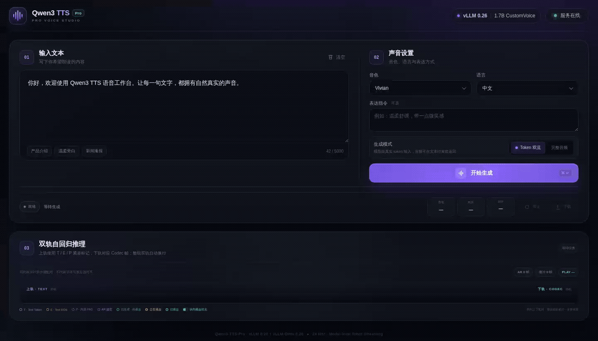
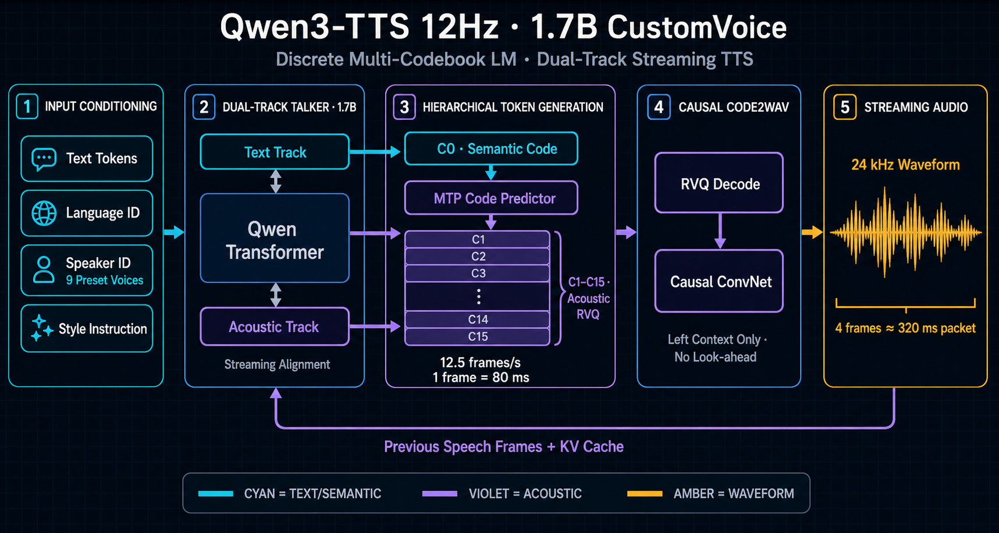

<div align="center">

# Qwen3-TTS-Pro

**面向 Qwen3-TTS 的高并发、模型级双流推理与可视化工程层**

[](https://github.com/QuadraV-Speech/Qwen3-TTS-Pro/actions/workflows/ci.yml)
[](CHANGELOG.md)
[](docs/installation.md)
[](docs/installation.md)
[](patches/README.md)
[](https://huggingface.co/Qwen/Qwen3-TTS-12Hz-1.7B-CustomVoice)
[](LICENSE)

Text Token 持续输入 · Codec Token 自回归生成 · PCM 音频同步输出

[功能亮点](#功能亮点) · [动态演示](#webui-动态演示) · [性能](#性能快照) · [快速开始](#快速开始) · [完整文档](docs/README.md)

</div>

> [!IMPORTANT]
> Qwen3-TTS-Pro 是独立的社区工程项目，不是 Qwen 官方仓库。本仓库不复制 Qwen3-TTS 官方源码、不分发模型权重，也不内置完整 vLLM-Omni；它通过固定版本补丁与公开接口完成集成。

## WebUI 动态演示

<p align="center">
  
</p>

<p align="center"><sub>真实服务录制：文本 Token 持续提交，Codec 帧同步增长；紫色表示自回归生成，青色表示待播放，琥珀色指针表示当前播放位置，绿色表示已播放。</sub></p>

WebUI 不只是一个请求表单。它把一次 TTS 推理拆成可观察的完整时间线：上轨渲染 `Text / EOS / PAD` 条件，下轨全量渲染等效 Codec 帧，并在已经生成的轨迹上实时推进播放进度。

## 功能亮点

| | 能力 | 当前实现 |
| --- | --- | --- |
| ⚡ | **模型级增量输入** | 通过 WebSocket 持续向正在推理的 Talker 热追加准确 Token ID |
| ⇄ | **输入、输出双流并行** | 文本尚未全部提交时，首批 PCM 已可返回并开始播放 |
| 🧠 | **KV 连续推理** | 更新文本条件时保留 Talker 历史 KV；输入不足时冻结请求，避免盲目续写 |
| 🎧 | **流式 Code2Wav** | 首包 1 帧、稳态 25 帧、72 帧左上下文，兼顾首包时延和块边界连续性 |
| 🚀 | **并发推理配置** | Async Scheduling、CUDA Graph、共享内存流与 Code2Wav 合批 |
| ◫ | **双轨可视化** | Text/EOS/PAD 与 Codec 帧上下配对、全量换行渲染、生成和播放状态着色 |
| 🔌 | **双接口服务** | OpenAI 兼容 `POST /v1/audio/speech` 与模型级双流 `WS /v1/audio/speech/stream` |
| 🧪 | **可复现实验** | 保留 A100 基线、旧版对照、并发数据与回退实验的原始聚合结果 |

### 当前能力状态

| 能力 | 状态 | 说明 |
| --- | :---: | --- |
| OpenAI 兼容 TTS API | ✅ | 完整音频或原始 PCM 输出流 |
| Token Plan 握手 | ✅ | 服务端统一分词，避免分片 BPE 边界变化造成乱读 |
| 模型级 Token 热追加 | ✅ | Talker 推理过程中继续追加条件，不按文本片段重复合成 |
| 暗色 WebUI 与实时播放 | ✅ | CustomVoice、TTFB、RTF、重播、下载与双轨时间线 |
| Codec Rendezvous | 🧪 | 归一化吞吐只提升 `0.44%`，因此默认关闭 |
| 原始 16 路 Codec ID 下发 | ⏳ | 当前界面根据 PCM 精确折算等效时间帧，不伪装成原始码本 Token |

## 模型级双流

普通“流式 TTS”通常只是一次性提交完整文本，再分块返回音频。Qwen3-TTS-Pro 增加了另一条并行流：客户端可以在 Talker 已经开始自回归之后继续提交文本 Token。

```text
Client / WebUI
   │
   ├── input.plan ──▶ 服务端统一分词
   ├── input.tokens × N ──▶ 热追加 Text 条件
   │                         │
   │                         ▼
   │                 Talker + 连续 KV Cache
   │                         │  第 0 路 Codec Code
   │                         ▼
   │                 MTP Code Predictor
   │                         │  其余 15 路 Codec Code
   │                         ▼
   └── binary PCM ◀── Streaming Code2Wav
```

```text
session.config
    → input.plan
    ← input.plan.ready
    → input.tokens × N
    ← audio.start + binary PCM × N
    → input.done
    ← audio.done + session.done
```

协议定义和客户端时序见 [模型级双流协议](docs/streaming-protocol.md)。

## 系统架构

<p align="center">
  
</p>

当前实测运行时是 **vLLM `0.26.0+cu129` + vLLM-Omni `v0.26.0`**，增强补丁基于 vLLM-Omni 提交 `a4ea67a`。Stage 0 执行 Talker 与 MTP 自回归，Stage 1 将分层 Codec 表示增量解码成 `24 kHz PCM16`；两阶段通过支持流式 Chunk 的共享内存连接器衔接。

更完整的模块边界见 [系统架构说明](docs/architecture.md)，音频解码原理见 [Codec Token 如何变成波形](docs/CODEC_TO_WAVEFORM.md)。

## 性能快照

单张 A100-SXM4-80GB 实测。测试时另有进程占用约 13.1 GiB，因此数据用于本项目版本回归和配置对照，不作为跨硬件性能保证。

| 并发 | 成功率 | TTFP P50 | RTF P50 | 音频吞吐 | 请求吞吐 |
| ---: | ---: | ---: | ---: | ---: | ---: |
| 1 | 100% | 48.30 ms | 0.116 | 8.65 audio-s/s | 1.21 req/s |
| 4 | 100% | 83.42 ms | 0.149 | 25.69 audio-s/s | 3.52 req/s |
| 8 | 100% | 104.92 ms | 0.192 | 39.38 audio-s/s | 5.29 req/s |
| 16 | 100% | 160.86 ms | 0.277 | 56.07 audio-s/s | 7.78 req/s |

`c1 / c4 / c8 / c16` 共 280 个正式请求全部完成。测试方法、官方基线口径与原始 JSON 见 [性能报告](docs/performance.md) 和 [benchmarks](benchmarks/README.md)。

## 快速开始

本项目不要求克隆或安装 Qwen3-TTS 官方 Python 仓库。运行时初始化脚本会获取固定版本的 vLLM-Omni，并应用本项目可审阅补丁。

```bash
git clone https://github.com/QuadraV-Speech/Qwen3-TTS-Pro.git
cd Qwen3-TTS-Pro

./scripts/setup_runtime.sh
./deployment/start_vllm_tts.sh
./deployment/start_vllm_tts_ui.sh
```

浏览器打开 `http://<server-ip>:7860`。首次模型下载、CUDA 环境适配和离线缓存方式见 [安装教程](docs/installation.md)；端口、GPU、日志、停止服务和接口测试见 [部署教程](docs/deployment.md)。

## 项目结构

```text
Qwen3-TTS-Pro/
├── deployment/     # 服务配置、生命周期脚本、WebUI 与测试客户端
├── patches/        # 相对 vLLM-Omni v0.26.0 的可审阅补丁
├── docs/           # 安装、架构、协议、原理、限制与性能文档
├── benchmarks/     # 实测报告与原始聚合 JSON
└── scripts/        # 运行时初始化和仓库自检工具
```

## 文档导航

| 使用与运维 | 原理与协议 | 性能与边界 |
| --- | --- | --- |
| [安装教程](docs/installation.md) | [系统架构](docs/architecture.md) | [性能与基线](docs/performance.md) |
| [部署与运维](docs/deployment.md) | [双流协议](docs/streaming-protocol.md) | [已知限制](docs/limitations.md) |
| [WebUI 双轨语义](docs/webui.md) | [Codec 到波形](docs/CODEC_TO_WAVEFORM.md) | [Rendezvous 回退实验](docs/CODEC_RENDEZVOUS_EXPERIMENT.md) |

## 项目边界

- 不分发模型权重；首次启动时按 Hugging Face 模型许可下载。
- 不复制 Qwen3-TTS 官方 SDK、推理实现、示例或微调代码。
- 不复制完整 vLLM-Omni；只维护针对固定 tag 的补丁。
- `Qwen3-TTS-Pro` 表示本项目的工程增强层，不表示新的官方模型权重。

## 开源与归属

本项目以 [Apache License 2.0](LICENSE) 发布，欢迎通过 [Issue 模板](.github/ISSUE_TEMPLATE/bug_report.yml) 和 [Pull Request](CONTRIBUTING.md) 参与改进。

补丁基于 Apache-2.0 的 vLLM-Omni v0.26.0，详细归属见 [NOTICE](NOTICE)。Qwen、Qwen3-TTS、vLLM 和 vLLM-Omni 的商标、模型许可与上游代码版权归各自权利人所有。
